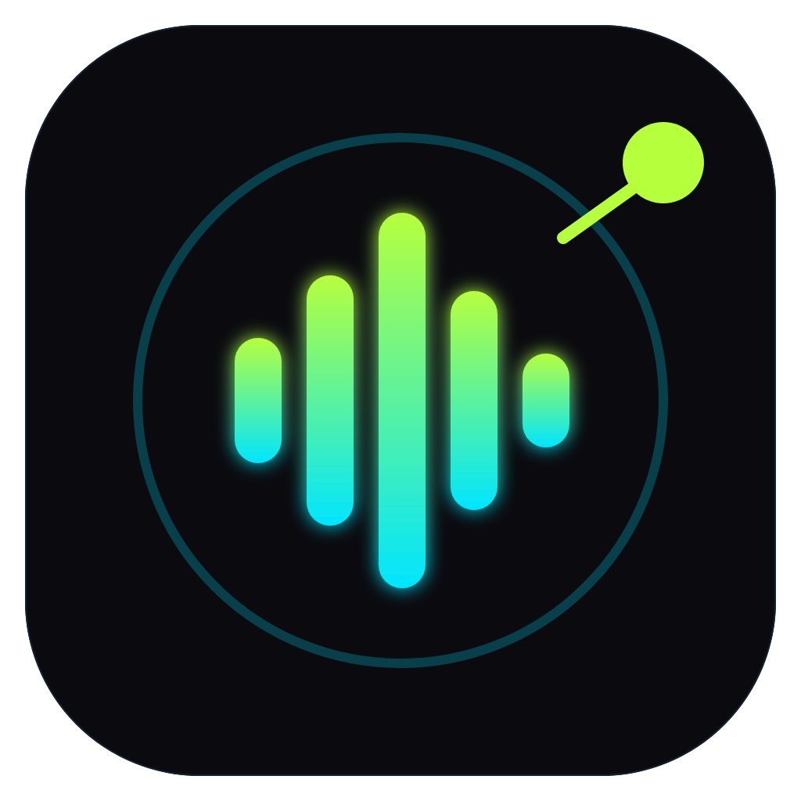
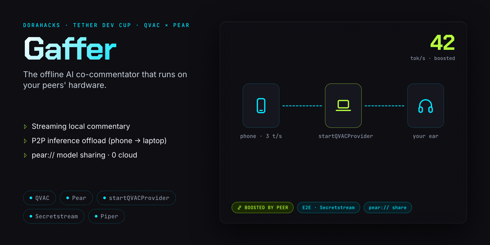
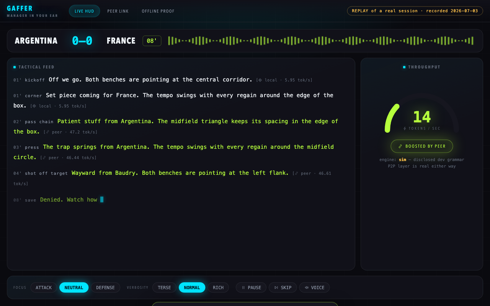
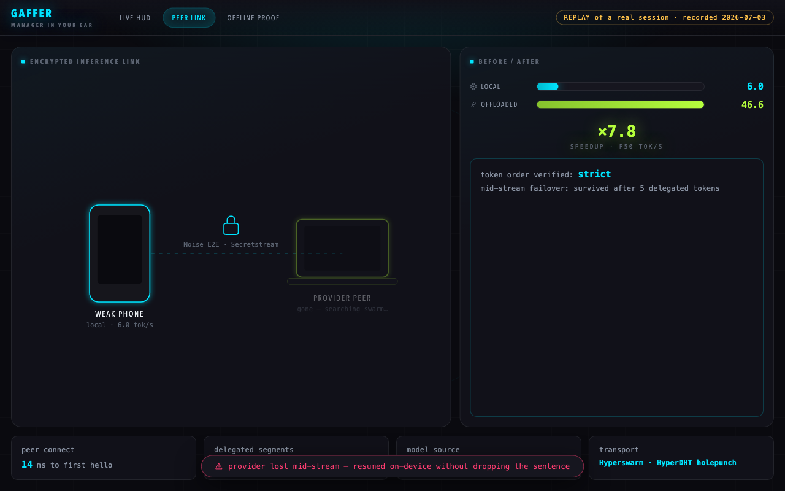
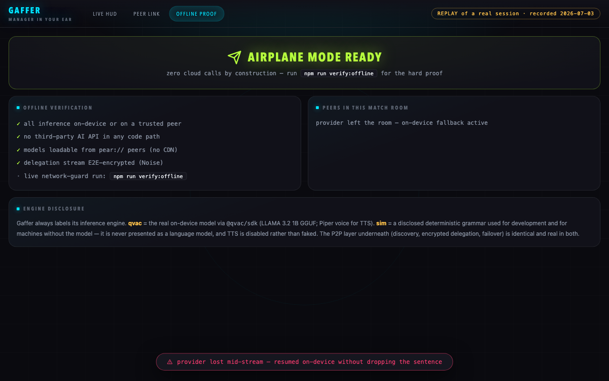
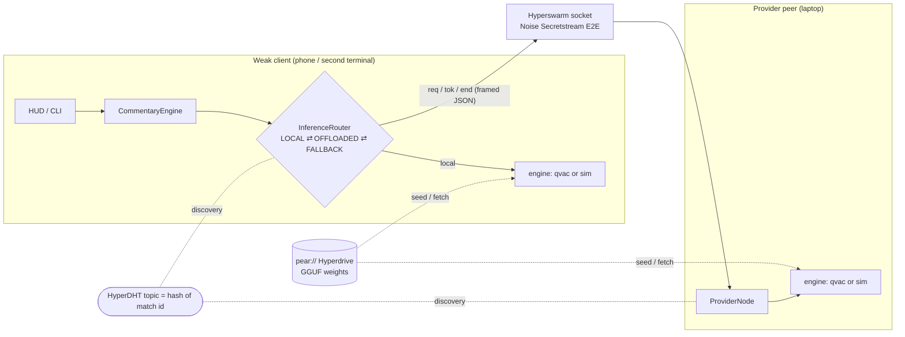

<p align="center"></p>

# Gaffer — the offline AI co-commentator that runs on your peers' hardware

> **Problem:** expert match commentary dies the moment the network drops — and the fans who most need an explainer carry the weakest phones.
> **Solution:** Gaffer streams tactical commentary from a model **on your own device** (QVAC), and when your device is too weak it **borrows a laptop peer's compute over an encrypted P2P link** (Pear stack) — zero cloud, zero API keys.
> **Built:** a working P2P inference-offload runtime with mid-sentence failover, `pear://` model sharing, a broadcast-style HUD, a reproducible benchmark, an offline-proof script and **220 passing tests** (incl. real-swarm integration).

<div align="center">
  <!-- static PNG for reliable GitHub rendering (camo strips SVG animation); animated: docs/assets/readme-hero-animated.svg -->
  

  <br/><br/>

  [](https://github.com/edycutjong/gaffer/actions/workflows/ci.yml)
  [](https://github.com/edycutjong/gaffer/actions/workflows/codeql.yml)
  [](https://edycutjong.github.io/gaffer/)

  
  
  

  
  
  
  
</div>

---

## See it in action

<div align="center">
  
  <br/><br/>
  
  <br/><br/>
  
</div>

> **The magic moment:** a weak client crawls at ~6 tok/s. A laptop joins the same match topic — and the gauge **surges to ~47 tok/s** with a lime `⇄ BOOSTED BY PEER` badge. Kill the laptop mid-sentence and the sentence **finishes anyway**, token-exact, from the local engine. All of it with the internet unplugged.

## Quick start (no accounts, no API keys)

```bash
git clone https://github.com/edycutjong/gaffer.git && cd gaffer
npm install                      # pure-JS P2P deps, ~20s

# one terminal (judge mode)
node cli.js --standalone

# … or the real thing, two terminals / two machines:
node cli.js --provider           # terminal A — the laptop brain
node cli.js --client             # terminal B — the weak phone

# desktop HUD (requires the Pear runtime: npm i -g pear)
pear run .

# proofs
npm test                         # 220 tests: unit + real-swarm integration
npm run bench                    # local vs offloaded tok/s, p50/p95
npm run verify:offline           # the whole flow with the internet blocked
```

The default engine is `auto`: it uses the **real QVAC engine** when `@qvac/sdk` is installed
(`npm run setup:qvac`, then the model downloads once — or arrives over `pear://`), and
otherwise falls back to a **clearly-labelled deterministic sim engine** so the P2P offload
is demoable on any machine. Every surface (CLI banner, HUD badge, bench header) states
which engine produced the tokens.

## ✓ What is real vs. simulated (read this)

| Layer | Status |
|---|---|
| Hyperswarm discovery, Noise-encrypted delegation, token streaming, ordering checks | **Real, always** — including in tests (loopback DHT testnet, no mocks) |
| Mid-stream provider death → local resume state machine | **Real, always** — exercised by integration tests and the recorded demo |
| `pear://` model sharing (Hyperdrive seed + fetch) | **Real, always** — byte-exact fetch verified in tests |
| LLM inference + Piper TTS | **Real with `@qvac/sdk` installed** (`--engine qvac`); otherwise a **disclosed** deterministic grammar (`--engine sim`) that is never presented as a model — TTS stays off rather than faking audio |
| Match events | Deterministic simulator (seeded fixtures) — Gaffer narrates feeds; it is not a licensed data product |
| Browser demo (`npm run demo:web`) | **Replay of a real recorded session**, badged as such — the surge is never faked |

## Architecture



- `lib/state.js` — the failover state machine, **every (state × event) pair defined and tested**
- `lib/router.js` — delegation with strict token ordering; deterministic engines resume
  **token-exact** after provider death, non-deterministic engines restart the segment (flagged) —
  honesty over magic
- `lib/protocol.js` — length-prefixed framed JSON over the already-encrypted swarm socket,
  hostile-frame guards included
- `lib/engines/qvac.js` — the real SDK adapter: `loadModel({modelSrc})` (local / http / `pear://`),
  `completion({modelId, history, stream:true})` → `tokenStream`, `textToSpeech` (Piper),
  `startQVACProvider({topic})` offered when available
- full details: [docs/ARCHITECTURE.md](docs/ARCHITECTURE.md) · [docs/COMPLEXITY.md](docs/COMPLEXITY.md)

## Benchmark (reproduce: `npm run bench`)

Measured on a cold clone (fresh `npm ci`), sim profiles (weak client 6 tok/s vs laptop
48 tok/s, **disclosed**), 12 segments, loopback swarm — the *transport* numbers are the real
product measurement. Expect ±2% run-to-run variance:

| Metric | ⌂ Local | ⇄ Offloaded |
|---|---|---|
| tokens/sec p50 | 5.99 | **46.7** |
| tokens/sec p95 | 5.99 | 47.8 |
| first token (p50) | 168 ms | **22 ms** |

- **Speedup ×7.8 (p50)** — the weak device streams at the laptop's rate
- **97%+ transport efficiency** — the P2P hop (framing + Noise + swarm) costs a few percent at most
- **≤ 25 ms** peer connect → OFFLOADED on loopback; LAN adds network RTT
- With `--engine qvac` the same bench measures real model tok/s on your hardware

## Tests — 220, all green

`npm test` runs **220 tests** (`node --test`, zero test-framework deps): protocol framing &
hostile-frame guards, topic derivation, deterministic match simulation, sim-engine grammar &
throttling, prompt construction, metrics math, **all 20 state-machine transitions**, router
failover semantics, commentary pacing/controls, offline network guard, and **real-swarm
integration** over a loopback HyperDHT testnet — provider discovery, delegated streaming with
strict ordering, **token-exact mid-stream failover**, provider recovery, cross-peer cancel,
concurrent clients, and byte-exact `pear://` model fetch. CI runs them on Node 20/22/24 plus
secret scanning, `verify:offline`, a bench artifact, and a submission-readiness gate that
re-verifies this README's test count against a live run.

`npm run coverage` holds `lib/` at **100% lines, 100% functions, and 100% branches** under
`node --test`'s native coverage. Three files are excluded from that unit gate — honestly, and
each for a real reason: `lib/engines/qvac.js` (the live `@qvac/sdk` on-device adapter — never
stubbed to fake coverage), `lib/engine.js` (its QVAC-load branches need the real SDK; the
fallback path is still tested), and `lib/modelshare.js` (real `pear://` Hyperdrive replication,
integration-proven). Nothing is mocked to inflate a number.

## Why ONLY QVAC + Pear

1. **`completion({stream:true})` → `tokenStream`** — the streaming commentary itself. Without it: a cloud LLM, which breaks the entire premise.
2. **`loadModel({modelSrc: 'pear://…'})`** — weights arrive from a peer, not HuggingFace; match day needs zero internet. Without it: a CDN download over dead stadium wifi.
3. **`startQVACProvider({topic})` / Gaffer's provider protocol** — a laptop lends its compute to a phone over P2P. **This is the capability unlock**; no cloud SDK can do it, because the transport *is* the Holepunch substrate QVAC ships on.
4. **`textToSpeech()` (Piper)** — the voice in your ear, on-device. Without it: a cloud TTS call and a privacy hole.
5. **Hyperswarm + HyperDHT** — the per-match room; peers are keypairs, holepunched directly. Without it: a signalling/TURN server you must run and trust.
6. **Secretstream (Noise)** — every delegated token is E2E-encrypted transport-level. Without it: TLS to a middlebox.
7. **Hyperdrive / Corestore** — the model as a P2P drive with sparse, verified replication. Without it: object storage + a CDN.

**Take QVAC + Pear out and you'd need:** a cloud LLM endpoint, a cloud TTS endpoint, a model
CDN, a signalling/TURN service, and a rented GPU — plus a privacy policy asking fans to trust
you. Gaffer replaces that stack with two devices talking directly.
Full brief: [docs/gaffer_dorahacks_submission.md](docs/gaffer_dorahacks_submission.md).

## ⚠ Honest limitations

- **Cold start:** first model load (download/mmap/warm-up) is slow; mitigated by `pear://`
  pre-seeding (`node scripts/seed_model.js`), and documented instead of hidden.
- **Generative, not factual:** Gaffer narrates a match event feed; it is not a licensed live-data product.
- **Token-exact resume is engine-conditional:** deterministic engines resume mid-sentence exactly;
  a real LLM restarts the segment (flagged `restarted` in the UI) because cross-device sampling
  determinism can't be honestly guaranteed.
- **The offline guard covers TCP/TLS/HTTP(S)/fetch;** the DHT itself speaks UDP — see
  [docs/AUDIT_REPORT.md](docs/AUDIT_REPORT.md) for the full threat model and residual risks.
- **`startQVACProvider` consumer-side pairing** isn't exercised in CI (needs the SDK + model
  installed); Gaffer's own delegation protocol carries the demo and the SDK-native provider is
  offered when present.

## Prior work — disclosed

- The streaming-`completion` loop shape follows **`tetherto/qvac-examples`**
  (`qvac-coffee-conversation`); the verified SDK surface comes from the official docs.
- Everything else — the delegation protocol, router/failover state machine, offline guard,
  match/commentary engines, HUD, scripts and tests — was written for this hackathon, in-window.

## Project structure

```
gaffer/
├── cli.js                 # two-terminal demo + judge mode
├── index.js               # importable library surface (offload helpers)
├── lib/                   # runtime: engines, swarm, protocol, router, state, metrics…
│   └── engines/           # qvac.js (real SDK adapter) · sim.js (disclosed dev engine)
├── app/                   # Pear desktop HUD (live) + replay mode for browsers
├── scripts/               # bench · verify_offline · seed · seed_model · lan_bootstrap …
├── test/                  # 220 tests (unit + integration over a loopback DHT)
├── docs/                  # DEMO · ARCHITECTURE · COMPLEXITY · AUDIT · pitch deck · friction log
├── landing/               # one-page explainer
└── data/fixtures/         # deterministic demo matches (3-2 thriller included)
```

## Docs

[DEMO.md](docs/DEMO.md) — exact two-machine demo steps & expected output ·
[ARCHITECTURE.md](docs/ARCHITECTURE.md) ·
[COMPLEXITY.md](docs/COMPLEXITY.md) ·
[AUDIT_REPORT.md](docs/AUDIT_REPORT.md) — invariants & threat model ·
[AUDIT_HACKATHON_REVIEW.md](docs/AUDIT_HACKATHON_REVIEW.md) — Round-of-32 judge-lens audit (code+docs) ·
[AUDIT_POLISH_WIN_WOW.md](docs/AUDIT_POLISH_WIN_WOW.md) — docs-only polish/wow audit ·
[friction-log.md](docs/friction-log.md) — real DX notes for the QVAC/Pear teams ·
[PITCH_DECK.md](docs/PITCH_DECK.md) ·
[SEED_DATA.md](docs/SEED_DATA.md) ·
[DoraHacks submission](docs/gaffer_dorahacks_submission.md)

## License

[Apache-2.0](LICENSE) © 2026 Edy Cu — as required by the Tether Developers Cup rules, and kept
that way afterwards.

---

*Built solo for the Tether Developers Cup 2026 (QVAC track, on the Pears stack). Thank you for
taking the time to review Gaffer — we wanted every fan to have a pundit in their ear, even the
one with a dead phone in the away end, and we're proudest that it never once phones home.*
