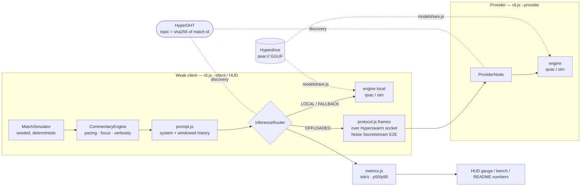

# Architecture — Gaffer (build)

> Spec-level architecture lives in the project spec; this file documents what was actually
> built, module by module, with the invariants the tests enforce.

## System diagram



## Module map (lib/)

| Module | Responsibility | Key invariant (tested) |
|---|---|---|
| `topic.js` | match id → 32-byte swarm topic | both sides derive identically; namespace versioned |
| `protocol.js` | framed JSON messages, validation | survives arbitrary chunk splits; rejects >4 MiB frames & malformed input without crashing |
| `swarm.js` | Hyperswarm room, hello/ping, peers | protocol version mismatch → disconnect, not undefined behaviour |
| `provider.js` | serve `req` → stream `tok`/`end` | per-request AbortController; cancel frees the slot |
| `router.js` | local vs offloaded, failover | strict token ordering (`i` monotone); deterministic resume skips exactly the delivered prefix |
| `state.js` | LOCAL ⇄ OFFLOADED ⇄ FALLBACK | **total** transition table — every (state × event) defined |
| `commentary.js` | event feed → paced segments | one segment at a time; priority events queue, others drop |
| `match.js` | deterministic match events | same seed ⇒ byte-identical event list; score never runs ahead of goals |
| `prompt.js` | QVAC-style history | sentence budget & focus encoded in the system prompt |
| `engines/sim.js` | disclosed dev engine | deterministic per (request, seed); labels itself; refuses to fake TTS |
| `engines/qvac.js` | real `@qvac/sdk` adapter | exact verified API names; explicit `--engine qvac` never silently downgrades |
| `metrics.js` | tok/s meter, p50/p95 | pure functions; mixed failover segments excluded from clean buckets |
| `modelshare.js` | `pear://` seed/fetch | fetched bytes identical to seeded bytes |
| `offline-guard.js` | block non-local net | loopback/LAN allowed, everything else throws `NetworkViolationError` |

## The delegation wire protocol

Frames: `[u32 LE length][JSON]` over the swarm's Noise secretstream (encryption is the
transport's, not ours — we add framing, typing, validation, and version handshake).

```
client → provider   req    { id, history[], seed, maxTokens }
provider → client   tok    { id, i, token }      (i strictly ascending; router enforces)
provider → client   end    { id, usage { tokens, ms, tps } }
provider → client   err    { id, message }
client → provider   cancel { id }
both                hello / announce / ping / pong
```

Design choice: Gaffer ships its **own engine-agnostic delegation protocol** so the offload
works with or without `@qvac/sdk` installed, and offers the **SDK-native**
`startQVACProvider({topic})` alongside when the real engine is up. This de-risks the demo
against SDK-surface drift (see DECISIONS.md #3) while still exercising the native path.

## Failover semantics (the part judges should poke)

1. Client streams a segment from the provider; every token is indexed.
2. Provider dies (socket close / token-gap timeout / error frame) → in-flight queue fails →
   state `OFFLOADED → FALLBACK` (double-dispatch safe).
3. **Deterministic engine** (sim): rerun the same `{history, seed}` locally, **skip the exact
   number of tokens already delivered**, keep streaming — the listener hears one seamless
   sentence. Verified token-exact by integration test.
4. **Non-deterministic engine** (real LLM): restart the segment locally, flagged
   `restarted: true` so the UI can clear the line — cross-device sampling determinism would be
   a dishonest promise.
5. Provider returns → `FALLBACK → OFFLOADED` (recovery tested).

## Where the numbers come from

- `scripts/bench.js` — p50/p95 tok/s local vs offloaded, first-token latency, connect time;
  JSON artifact in CI.
- `router.stats` (SessionStats) — powers the CLI session report and the HUD before/after panel.
- Connect latency = "searching → provider found" (re-arms when the last provider leaves).
