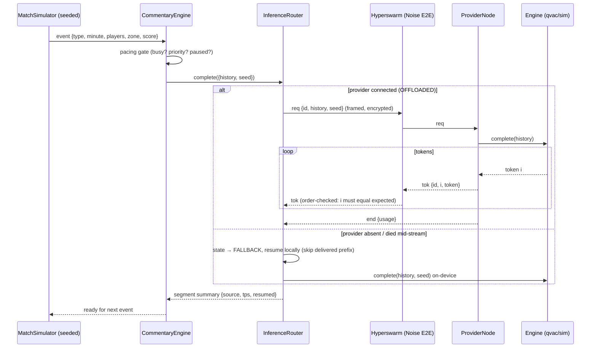

# Complexity Blueprint — Gaffer

> The 5-layer complexity audit (per the squeeze-complexity workflow), mapped to what the
> build actually ships. Blockchain-specific layers are adapted honestly: Gaffer's track is
> on-device AI + P2P, so "economic engine" becomes resource delegation and "mainnet" becomes
> live-network credibility.

## 1. High-complexity data pipeline



## 2. Cryptographic schema

- **Transport envelope:** every peer link is a Hyperswarm connection = **Noise-protocol
  secretstream** (XChaCha20-Poly1305 under the hood via libsodium). Gaffer adds no crypto of
  its own on top — deliberately: the substrate's E2E is audited and free.
- **Identity:** peers are **Ed25519 keypairs** (HyperDHT), not IP addresses; the HUD shows the
  remote public key prefix as the peer identity.
- **Topic derivation:** `topic = blake2b-256("gaffer/match/v1:" + matchId)` via
  `hypercore-crypto.hash` — both sides derive independently; no rendezvous server.
- **Model integrity:** `pear://` weights ride Hyperdrive/Hypercore — **signed, hash-verified,
  sparse replication**; a tampered block fails verification at the transport layer.
- **Enclave/TEE:** none — out of scope, listed as residual risk in AUDIT_REPORT.md.

## 3. Resource-delegation engine (the "economic" layer, honestly scoped)

- **Capability announcement:** providers broadcast `announce {engine, model, tps}` on hello;
  clients route to the first live provider and re-route on failure (state machine, tested).
- **Backpressure & fairness:** one AbortController per request id; `cancel` frames free the
  provider slot mid-stream (tested cross-peer). Concurrent clients are served independently
  (tested: two clients, one provider).
- **Firewalling:** `startQVACProvider({topic, firewall})` — the SDK-native provider accepts a
  firewall callback; Gaffer's own provider trusts the match room today (residual risk,
  documented) — a pairing-key firewall is the roadmap item.
- **No token/on-chain layer:** deliberately none. A payment rail (e.g. WDK) around delegated
  inference is future work, not vapor in this submission.

## 4. Developer toolkit architecture

**SDK surface (importable — `import { … } from 'gaffer'`):**

```ts
class ProviderNode {
  constructor(opts: { matchId: string, engine: Engine, bootstrap?: Node[], nativeProvider?: boolean })
  start(): Promise<this>            // joins the topic, serves completions
  stop(): Promise<void>
  on('client' | 'served' | 'request', fn): this
}

class InferenceRouter {
  constructor(opts: { matchId: string, engine: Engine, p2p?: boolean, tokenGapTimeoutMs?: number })
  start(): Promise<this>
  complete(req: { history: Turn[], seed?: number, maxTokens?: number, signal?: AbortSignal })
    : { stream: AsyncIterable<{ token, i, source }>, result: Promise<Segment> }
  on('state' | 'provider' | 'failover' | 'segment' | 'token', fn): this
}

createEngine({ engine: 'auto' | 'sim' | 'qvac', tps?, modelSrc? })
  : Promise<{ engine: Engine, fallback: boolean }>
```

**CLI reference:** `node cli.js --help` (modes: `--standalone | --provider | --client`;
knobs: match, engine, seed, focus, verbosity, tps, speed, bootstrap, model-src, tts).

**Protocol spec:** docs/ARCHITECTURE.md §"delegation wire protocol" — message grammar,
ordering invariant, version handshake, frame-size bound.

## 5. Verification & performance proofs

- **`scripts/bench.js`** — p50/p95/mean tok/s local vs offloaded + first-token latency +
  connect time; `--json` artifact uploaded by CI. Real cold-clone output from this machine:
  speedup **×7.8 (p50)**, transport efficiency **97%+**, connect **≤25 ms** (loopback).
- **`scripts/verify_offline.js`** — process-wide network guard (net/tls/http/https/fetch),
  full standalone + full P2P loop on a loopback-only DHT; any remote host ⇒ loud failure.
- **`scripts/seed.js`** — deterministic fixtures (same seed ⇒ byte-identical files); the demo
  match is a 3-2 thriller with an 86th-minute winner (seed 2047).
- **`scripts/check_submission_readiness.js`** — placeholder scan, licence gate, and a live
  re-run of the suite to verify the README's stated test count.
- **220 tests** — `node --test`, unit + real-swarm integration (no mocked network anywhere).
